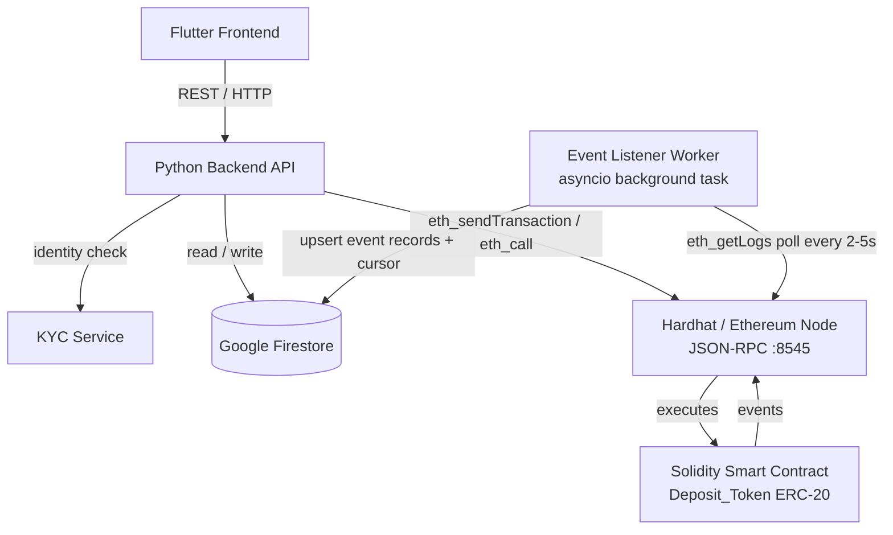

# Design Document: Tokenized Deposits POC

## Overview

This document describes the technical design for T-Bank's Tokenized Deposits Proof of Concept. The system
allows KYC-verified bank clients to hold fiat deposits represented as ERC-20 tokens (`Deposit_Token`) on
an Ethereum blockchain. A Python backend API orchestrates all business logic, a Solidity smart contract
governs on-chain token operations, Google Firestore persists off-chain state, and a Flutter frontend
provides the client-facing interface.

The POC targets a local Hardhat network for demonstration. The design prioritises correctness and
auditability over production-scale throughput.

---

## Architecture



Key design decisions:
- The Backend_API is the sole signer of on-chain transactions (operator key). Clients never hold private keys in the POC.
- Firestore is the off-chain source of truth; the smart contract is the on-chain source of truth. The reconciliation endpoint bridges the two.
- All minting and burning is gated by an on-chain KYC allowlist maintained by the contract owner.
- The Event Listener Worker runs as a background asyncio task inside the Backend_API process, providing eventual consistency between on-chain events and Firestore independently of the API request flow.

---

## Components and Interfaces

### 1. KYC Service

A lightweight adapter that wraps an external (or stubbed) identity-verification provider.

```
POST /kyc/verify
  Body: { client_id, name, document_number, ... }
  Response: { status: "approved" | "failed", reason?: string }
```

For the POC the service can be a stub that approves all well-formed requests.

---

### 2. Python Backend API

Built with FastAPI. Exposes the following REST endpoints:

| Method | Path | Description |
|--------|------|-------------|
| POST | `/clients` | Submit KYC and create client record |
| POST | `/clients/{id}/wallet` | Create wallet after KYC approval |
| POST | `/clients/{id}/deposit` | Initiate deposit → mint tokens |
| POST | `/clients/{id}/withdraw` | Initiate withdrawal → burn tokens |
| GET  | `/clients/{id}/balance` | Query on-chain token balance |
| GET  | `/clients/{id}/transactions` | Fetch transaction history from Firestore |
| GET  | `/admin/reconcile` | Compare on-chain balances with Firestore |
| POST | `/admin/pause` | Pause the smart contract |
| POST | `/admin/unpause` | Unpause the smart contract |

The API uses `web3.py` to interact with the Hardhat node and the `google-cloud-firestore` SDK for Firestore.

---

### 3. Solidity Smart Contract (`DepositToken.sol`)

Inherits OpenZeppelin `ERC20`, `Ownable`, and `Pausable`.

```solidity
// Key interface (abbreviated)
function registerWallet(address wallet) external onlyOwner;
function revokeWallet(address wallet) external onlyOwner;
function mint(address to, uint256 amount) external onlyOwner whenNotPaused;
function burn(address from, uint256 amount) external onlyOwner whenNotPaused;
function pause() external onlyOwner;
function unpause() external onlyOwner;
function isApproved(address wallet) external view returns (bool);

event Mint(address indexed recipient, uint256 amount);
event Burn(address indexed source, uint256 amount);
```

Only the contract owner (the Backend_API operator key) can call state-changing functions.
`mint` and `burn` revert if the target wallet is not in the KYC allowlist.

---

### 4. Event Listener Worker

A background asyncio task that runs inside the Backend_API process. It provides eventual consistency between on-chain state and Firestore by polling the Hardhat node for new events independently of the API request flow.

**Responsibilities:**
- Polls `eth_getLogs` on the Hardhat JSON-RPC endpoint (`http://localhost:8545`) every 2–5 seconds
- Filters logs by the `DepositToken` contract address and `Mint`/`Burn` event topics
- Processes events from `last_processed_block + 1` to the current latest block
- Upserts a Firestore `transactions` record for each event (idempotent — keyed on `on_chain_tx_hash`)
- Updates the `last_processed_block` cursor in the `system/event_listener` Firestore document after each successful batch
- On startup, reads `last_processed_block` from Firestore to resume without reprocessing past events

**Lifecycle:**
- Started as an asyncio background task when the FastAPI application starts (`lifespan` context)
- Runs indefinitely until the process exits
- On Firestore write failure, retries up to 3 times with exponential backoff (same logic as the API path)

---

### 5. Flutter Frontend Google Firestore Collections

| Collection | Document ID | Purpose |
|------------|-------------|---------|
| `clients` | `{client_id}` | Client record with KYC status and wallet address |
| `transactions` | `{tx_id}` | Deposit/withdrawal records with status and tx hash |
| `system` | `event_listener` | Event listener block cursor for restart recovery |

---

### 6. Flutter Frontend

Single-page views:
- KYC submission form
- Wallet display
- Deposit / withdrawal forms
- Balance and transaction history list

Communicates exclusively with the Backend_API over HTTPS.

---

## Data Models

### Firestore: `clients/{client_id}`

```json
{
  "client_id": "string",
  "name": "string",
  "kyc_status": "pending | approved | failed | revoked",
  "kyc_failure_reason": "string | null",
  "wallet_address": "string | null",
  "created_at": "timestamp"
}
```

### Firestore: `transactions/{tx_id}`

```json
{
  "tx_id": "string",
  "client_id": "string",
  "wallet_address": "string",
  "type": "deposit | withdrawal",
  "amount": "number",
  "status": "pending | confirmed | failed",
  "on_chain_tx_hash": "string | null",
  "created_at": "timestamp",
  "updated_at": "timestamp"
}
```

### Firestore: `system/event_listener`

```json
{
  "last_processed_block": "number",
  "updated_at": "timestamp"
}
```

### On-chain state (ERC-20 + allowlist)

```
balanceOf(address) → uint256          // standard ERC-20
isApproved(address) → bool            // KYC allowlist
totalSupply() → uint256               // standard ERC-20
paused() → bool                       // Pausable
```

---

## Correctness Properties

*A property is a characteristic or behavior that should hold true across all valid executions of a system — essentially, a formal statement about what the system should do. Properties serve as the bridge between human-readable specifications and machine-verifiable correctness guarantees.*

### Property 1: KYC gate on wallet creation

*For any* client identity submission, no Ethereum wallet address is assigned to the client record in Firestore unless the KYC_Service has returned an "approved" status for that client.

**Validates: Requirements 1.1, 1.2**

---

### Property 2: KYC failure stores reason and blocks wallet

*For any* client whose KYC verification fails, the Firestore client record should have `kyc_status == "failed"`, a non-null `kyc_failure_reason`, and `wallet_address == null`.

**Validates: Requirements 1.3**

---

### Property 3: Non-allowlisted wallet cannot mint

*For any* wallet address that is not currently in the on-chain KYC allowlist (either never registered or revoked), calling `mint` on the smart contract should revert.

**Validates: Requirements 1.4, 1.5**

---

### Property 4: Wallet creation is idempotent and stored

*For any* KYC-approved client, calling the wallet creation endpoint once or multiple times should result in exactly one wallet address being stored in Firestore, and `isApproved(wallet_address)` on the contract should return `true`.

**Validates: Requirements 2.1, 2.2, 2.3, 2.4**

---

### Property 5: Deposit minting increases on-chain balance by exact amount

*For any* KYC-approved wallet and deposit amount N > 0, after a successful deposit confirmation the on-chain `balanceOf(wallet)` should increase by exactly N compared to its pre-deposit value.

**Validates: Requirements 3.2**

---

### Property 6: Successful mint updates Firestore to confirmed with tx hash

*For any* deposit that results in a successful on-chain mint, the corresponding Firestore transaction record should have `status == "confirmed"` and a non-null `on_chain_tx_hash`.

**Validates: Requirements 3.1, 3.3**

---

### Property 7: Failed mint leaves balance and Firestore record unchanged

*For any* deposit where the on-chain mint transaction fails, the wallet's on-chain balance should be unchanged and the Firestore transaction record should have `status == "failed"`.

**Validates: Requirements 3.4**

---

### Property 8: Mint emits event with correct address and amount

*For any* successful `mint(to, amount)` call, the transaction receipt should contain exactly one `Mint` event with `recipient == to` and `amount` matching the minted value.

**Validates: Requirements 3.6**

---

### Property 9: Withdrawal rejected when balance insufficient

*For any* withdrawal request of amount N where the wallet's on-chain balance is less than N, the Backend_API should reject the request with a descriptive error and the balance should remain unchanged.

**Validates: Requirements 4.1, 4.2**

---

### Property 10: Withdrawal burning decreases on-chain balance by exact amount

*For any* KYC-approved wallet with balance >= N and withdrawal amount N > 0, after a successful withdrawal the on-chain `balanceOf(wallet)` should decrease by exactly N.

**Validates: Requirements 4.3**

---

### Property 11: Successful burn updates Firestore to confirmed with tx hash

*For any* withdrawal that results in a successful on-chain burn, the corresponding Firestore transaction record should have `status == "confirmed"` and a non-null `on_chain_tx_hash`.

**Validates: Requirements 4.4**

---

### Property 12: Failed burn leaves balance and Firestore record unchanged

*For any* withdrawal where the on-chain burn transaction fails, the wallet's on-chain balance should be unchanged and the Firestore transaction record should have `status == "failed"`.

**Validates: Requirements 4.5**

---

### Property 13: Burn emits event with correct address and amount

*For any* successful `burn(from, amount)` call, the transaction receipt should contain exactly one `Burn` event with `source == from` and `amount` matching the burned value.

**Validates: Requirements 4.6**

---

### Property 14: Balance endpoint mirrors on-chain state

*For any* wallet address, the value returned by `GET /clients/{id}/balance` should equal `balanceOf(wallet_address)` queried directly on the smart contract at the same block.

**Validates: Requirements 5.1**

---

### Property 15: Transaction history endpoint returns all and only Firestore records

*For any* client, the list returned by `GET /clients/{id}/transactions` should contain exactly the set of transaction records stored in Firestore for that client — no more, no fewer.

**Validates: Requirements 5.2**

---

### Property 16: Only owner can call privileged contract functions

*For any* address that is not the contract owner, calling `mint`, `burn`, `registerWallet`, `revokeWallet`, or `pause` should revert.

**Validates: Requirements 6.1**

---

### Property 17: Pause halts mint and burn; unpause restores them

*For any* wallet, after the contract is paused, both `mint` and `burn` calls should revert. After unpausing, the same calls with valid parameters should succeed.

**Validates: Requirements 6.2**

---

### Property 18: API rejects deposit and withdrawal while contract is paused

*For any* deposit or withdrawal request submitted while the smart contract is paused, the Backend_API should return an error response and not submit an on-chain transaction.

**Validates: Requirements 6.3**

---

### Property 19: On-chain event produces complete Firestore record

*For any* `Mint` or `Burn` event emitted by the smart contract, the Backend_API should write a Firestore record containing all four required fields: wallet address, amount, transaction hash, and timestamp.

**Validates: Requirements 7.1**

---

### Property 20: Client record contains all required fields

*For any* client created via the Backend_API, the Firestore document should contain non-null values for: `client_id`, `kyc_status`, `wallet_address` (once assigned), and `created_at`.

**Validates: Requirements 7.2**

---

### Property 21: Firestore write retried up to 3 times on failure

*For any* on-chain event that triggers a Firestore write, if the write fails, the Backend_API should retry the write up to 3 times before recording a permanent failure — no more, no fewer retries.

**Validates: Requirements 7.3**

---

### Property 22: Reconciliation detects all balance discrepancies

*For any* set of on-chain balances and Firestore records, the reconciliation endpoint should return a list that contains every wallet where the on-chain balance differs from the Firestore-recorded balance, and no wallets where they agree.

**Validates: Requirements 7.4**

---

### Property 23: Event listener upsert is idempotent

*For any* `Mint` or `Burn` event, processing that event through the event listener once or multiple times should produce the same Firestore record — the final state should be identical regardless of how many times the event is processed.

**Validates: Requirements 7.1**

---

### Property 24: On-chain event reflected in Firestore within one poll interval

*For any* `Mint` or `Burn` event emitted on-chain, after waiting one poll interval (≤ 5 seconds), the corresponding Firestore `transactions` record should exist with the correct wallet address, amount, transaction hash, and timestamp.

**Validates: Requirements 5.4, 7.1**

---

### Property 25: Block cursor persistence enables restart recovery

*For any* sequence of blocks processed by the event listener, the `last_processed_block` value stored in `system/event_listener` should equal the highest block number successfully processed. On restart, the listener should resume from that block and not re-emit duplicate Firestore writes for already-processed events.

**Validates: Requirements 7.1, 7.3**

---

## Error Handling

| Scenario | Layer | Behaviour |
|----------|-------|-----------|
| KYC verification fails | Backend_API | Return 422 with failure reason; store reason in Firestore; do not create wallet |
| Wallet creation for non-KYC client | Backend_API | Return 403 |
| Duplicate wallet creation | Backend_API | Return existing wallet address (idempotent, 200) |
| Deposit/withdrawal while contract paused | Backend_API | Return 503 with "contract paused" message |
| Insufficient balance on withdrawal | Backend_API | Return 422 with current balance in error body |
| On-chain transaction reverts | Backend_API | Catch revert reason from web3.py; update Firestore to "failed"; return 502 |
| Firestore write failure (API path) | Backend_API | Retry up to 3 times with exponential backoff; log permanent failure after 3rd attempt |
| Firestore write failure (event listener) | Event_Listener | Retry up to 3 times with exponential backoff; log permanent failure after 3rd attempt; advance cursor only after successful write |
| Event listener process crash / restart | Event_Listener | On startup, read `last_processed_block` from `system/event_listener` in Firestore; resume polling from that block; idempotent upserts prevent duplicate records |
| Non-owner calls privileged contract function | Smart_Contract | Revert with `OwnableUnauthorizedAccount` |
| Mint/burn to non-allowlisted wallet | Smart_Contract | Revert with `WalletNotApproved` |
| Mint/burn while paused | Smart_Contract | Revert with `EnforcedPause` (OpenZeppelin Pausable) |

All Backend_API error responses follow a consistent JSON envelope:

```json
{ "error": "string", "detail": "string | null" }
```

---

## Testing Strategy

### Dual Testing Approach

Both unit tests and property-based tests are required. They are complementary:
- Unit tests cover specific examples, integration points, and error conditions.
- Property-based tests verify universal correctness across randomised inputs.

### Smart Contract Tests (Hardhat + Chai)

Use Hardhat's built-in testing framework with `ethers.js` and `@nomicfoundation/hardhat-chai-matchers`.

Unit test examples:
- Deploy contract and verify owner is set correctly (Requirement 6.1)
- Register a wallet and verify `isApproved` returns true (Requirement 2.3)
- Mint to approved wallet and verify balance (Requirement 3.2)
- Attempt mint to non-approved wallet and expect revert (Requirement 1.4)
- Pause contract and attempt mint, expect revert (Requirement 6.2)
- Verify `Mint` and `Burn` events are emitted with correct args (Requirements 3.6, 4.6)
- Verify ERC-20 interface: `balanceOf`, `totalSupply`, `transfer` (Requirement 6.4)

Property-based tests use **fast-check** (JavaScript PBT library) integrated with Hardhat:
- Minimum 100 iterations per property test
- Each test tagged with: `// Feature: tokenized-deposits-poc, Property N: <property_text>`

Property tests to implement (mapping to design properties):

| Property | Test description |
|----------|-----------------|
| P3 | For any non-allowlisted address, mint reverts |
| P5 | For any approved wallet and amount N, balance increases by exactly N after mint |
| P8 | For any mint call, Mint event contains correct address and amount |
| P10 | For any wallet with balance >= N, balance decreases by exactly N after burn |
| P13 | For any burn call, Burn event contains correct address and amount |
| P16 | For any non-owner address, privileged calls revert |
| P17 | Pause then unpause is a round trip for mint/burn availability |

### Backend API Tests (pytest + Hypothesis)

Use **pytest** with **Hypothesis** for property-based testing of the Python backend.

Unit test examples:
- KYC approval flow creates client record with correct fields
- KYC failure stores reason and blocks wallet creation
- Deposit endpoint creates pending Firestore record
- Withdrawal rejected when balance < N
- Reconciliation endpoint returns correct discrepancies

Property tests (Hypothesis strategies):

| Property | Test description |
|----------|-----------------|
| P1 | For any client, wallet_address is null unless kyc_status == "approved" |
| P2 | For any failed KYC, failure_reason is non-null and wallet_address is null |
| P4 | Wallet creation is idempotent: calling twice returns same address |
| P6 | For any successful mint, Firestore record has status "confirmed" and non-null tx_hash |
| P7 | For any failed mint, balance unchanged and Firestore status "failed" |
| P9 | For any withdrawal where amount > balance, API returns error |
| P11 | For any successful burn, Firestore record has status "confirmed" and non-null tx_hash |
| P12 | For any failed burn, balance unchanged and Firestore status "failed" |
| P14 | Balance endpoint value equals on-chain balanceOf at same block |
| P15 | Transaction history contains exactly the Firestore records for that client |
| P18 | All deposit/withdrawal requests while paused return error |
| P19 | Every on-chain event produces a Firestore record with all 4 required fields |
| P20 | Every client record contains all required fields |
| P21 | Firestore write retried exactly up to 3 times on failure |
| P22 | Reconciliation returns all and only discrepant wallets |
| P23 | Event listener upsert is idempotent: processing same event N times yields same Firestore record |
| P24 | After any on-chain Mint/Burn, Firestore reflects the event within one poll interval |
| P25 | Block cursor stored in Firestore equals highest successfully processed block; listener resumes from it on restart |

Each Hypothesis property test is configured with `@settings(max_examples=100)` and tagged:

```python
# Feature: tokenized-deposits-poc, Property N: <property_text>
@settings(max_examples=100)
@given(...)
def test_property_N_...(...)
```

### Flutter Frontend Tests

- Widget tests for KYC form, wallet display, deposit/withdrawal forms, and transaction history list.
- Integration tests using `flutter_test` to verify balance and history are rendered after API responses.
- No property-based tests required for UI layer (UI requirements are not testable as properties per prework analysis).
