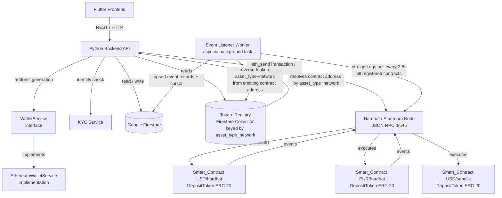
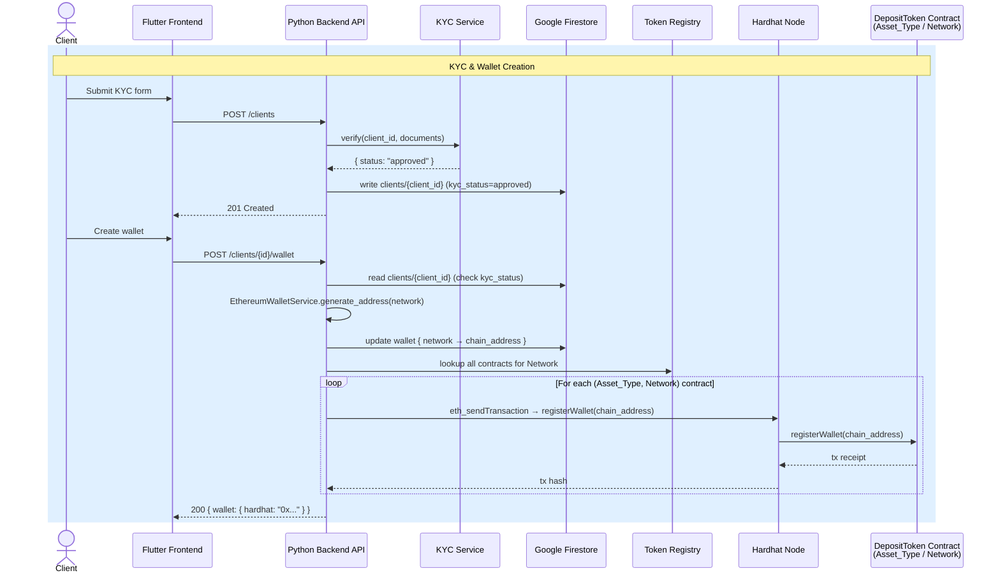
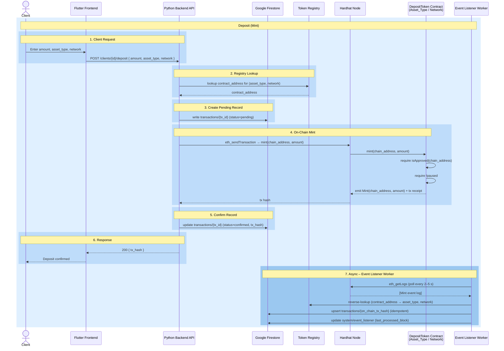
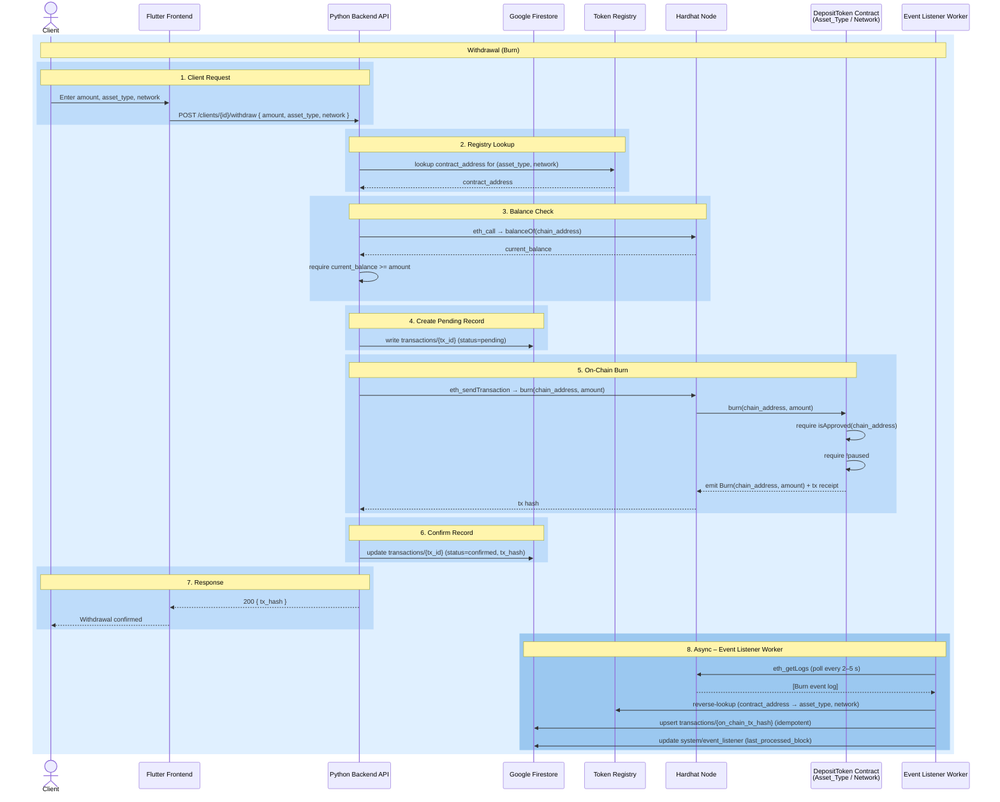
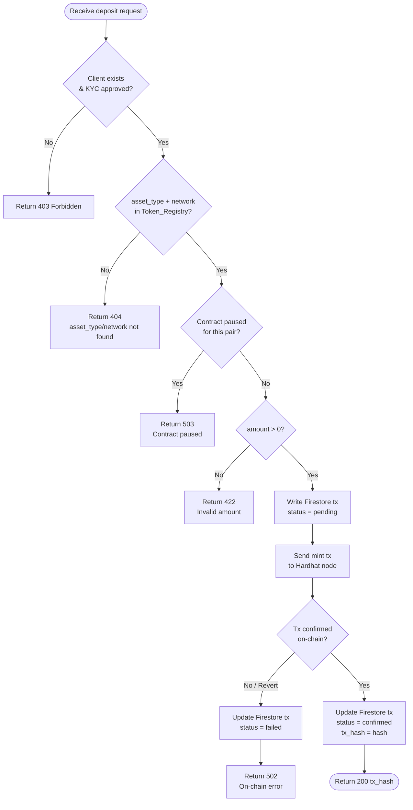
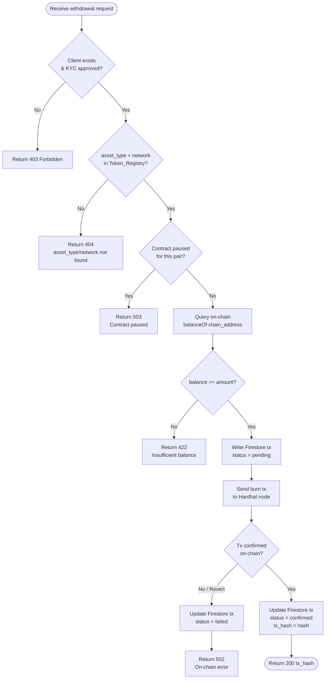
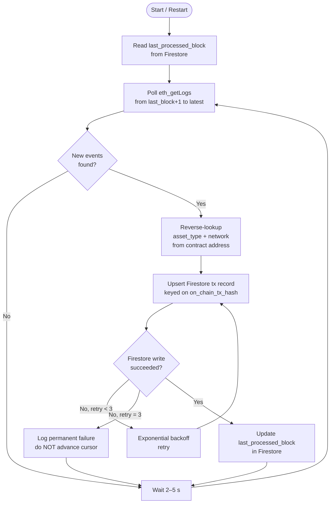

# Design Document: Tokenized Deposits POC

## Overview

This document describes the technical design for T-Bank's Tokenized Deposits Proof of Concept. The system
allows KYC-verified bank clients to hold fiat deposits represented as ERC-20 tokens (`Deposit_Token`) on
a blockchain. A Python backend API orchestrates all business logic, Solidity smart contracts govern
on-chain token operations (one per `(Asset_Type, Network)` pair), Google Firestore persists off-chain
state, and a Flutter frontend provides the client-facing interface.

The `Wallet` model is chain-agnostic: a single logical `Wallet` is identified by the client's identifier
and stores a `Network → Chain_Address` mapping in Firestore. A `WalletService` interface abstracts
address generation per `Network`; the only implementation for this POC is `EthereumWalletService`, which
generates Ethereum EOA addresses for the `"hardhat"` and `"sepolia"` Networks. Adding a new `Network`
in the future requires only a new `WalletService` implementation — no changes to the `Wallet` data model
or existing client records.

One `Smart_Contract` (ERC-20) is deployed per `(Asset_Type, Network)` pair. The `Token_Registry` stored
in Firestore maps each `(Asset_Type, Network)` pair to its deployed `Smart_Contract` address, with the
Firestore document ID formatted as `{asset_type}_{network}` (e.g., `USD_hardhat`). All deposit,
withdrawal, balance, and history operations are `(Asset_Type, Network)`-aware. Admin pause/unpause
controls operate per `(Asset_Type, Network)` independently.

The POC targets a local Hardhat network for demonstration. The design prioritises correctness and
auditability over production-scale throughput.

**Known Limitation — Off-Chain Assets:** The `WalletService` abstraction decouples the `Wallet` from any
specific blockchain, but it still assumes every asset is represented by a `Smart_Contract` on a `Network`.
Assets that exist outside a blockchain (e.g., traditional securities, fiat balances in a core banking
system, commodities, loyalty points) are not supported. Extending the design to cover off-chain assets
would require replacing `Network` with a broader `AssetPlatform` concept (blockchain, custodian API, or
internal ledger) and replacing `Chain_Address` with a generic `AccountReference`. The `Token_Registry`
and `WalletService` interfaces would need corresponding generalisation. This is out of scope for the
current POC.

---

## Architecture



---

## Sequence Diagram

The following diagrams show the end-to-end flow for the two primary client operations. Each diagram has its own actor header row for readability.

### KYC & Wallet Creation



### Deposit (Mint)



### Withdrawal (Burn)



---

## Activity Diagram

The following diagrams capture the decision logic for the two core flows — **Deposit** and **Withdrawal** — from the Backend API's perspective, including all guard checks and error paths. The Event Listener Worker loop is shown separately.

### Deposit Flow



### Withdrawal Flow



### Event Listener Worker



---

Key design decisions:
- The Backend_API is the sole signer of on-chain transactions (operator key). Clients never hold private keys in the POC. This is a conscious simplification consistent with how real tokenized deposit systems operate. In production, a KMS (e.g., AWS KMS, HashiCorp Vault) would replace the local operator key.
- The `Wallet` is a logical construct identified by `client_id`. It stores a `Network → Chain_Address` map in Firestore. A `WalletService` interface abstracts address generation; `EthereumWalletService` is the only implementation, generating EOA addresses for Ethereum-based Networks (`"hardhat"`, `"sepolia"`).
- One `DepositToken.sol` contract is deployed per `(Asset_Type, Network)` pair. All contracts share the same bytecode; `Asset_Type` and `Network` labels are passed as constructor arguments.
- The `Token_Registry` in Firestore is the authoritative mapping from `(Asset_Type, Network)` → contract address. Document IDs use the format `{asset_type}_{network}` (e.g., `USD_hardhat`). The Backend_API loads this registry on startup and refreshes it when a new entry is added.
- Firestore is the off-chain source of truth; the smart contracts are the on-chain source of truth. The reconciliation endpoint bridges the two, operating per `(Asset_Type, Network)` pair.
- All minting and burning is gated by an on-chain KYC allowlist maintained by each contract's owner. Wallet registration must be performed on every contract in the `Token_Registry` for the relevant `Network`.
- Admin pause/unpause is per-contract (per `(Asset_Type, Network)` pair). Pausing `USD/hardhat` does not affect `EUR/hardhat` or `USD/sepolia`.
- The Event Listener Worker monitors all contracts listed in the `Token_Registry` and resolves `(Asset_Type, Network)` for each event by reverse-looking up the emitting contract address in the registry. Each Firestore record is tagged with both `asset_type` and `network`.
- **Hardhat state persistence:** The local Hardhat node runs entirely in memory by default — all deployed contracts and token balances are lost on restart. To preserve chain state across restarts, the node is started with `--save-state` and resumed with `--load-state`:
  ```bash
  # First run — start node and save state on exit
  npx hardhat node --save-state .hardhat-state.json

  # Subsequent runs — resume from saved state
  npx hardhat node --load-state .hardhat-state.json --save-state .hardhat-state.json
  ```
  `.hardhat-state.json` is added to `.gitignore`. If no state file exists (e.g., first run or intentional reset), the node starts from a blank chain and contracts must be redeployed. The `Token_Registry` in Firestore must always match the deployed contract addresses — if the chain is reset, the `token_registry` collection must be reseeded to match the new deployment.

---

## Components and Interfaces

### 1. KYC Service

A lightweight adapter that wraps an external (or stubbed) identity-verification provider.

```
POST /kyc/verify
  Body: { client_id, name, document_number, ... }
  Response: { status: "approved" | "failed", reason?: string }
```

For the POC the service can be a stub that approves all well-formed requests.

---

### 2. WalletService

An interface that abstracts Chain_Address generation per Network. The Backend_API calls
`WalletService.generate_address(network: str) -> str` when creating a new Wallet.

```python
class WalletService(Protocol):
    def generate_address(self, network: str) -> str: ...

class EthereumWalletService:
    """Generates Ethereum EOA addresses for 'hardhat' and 'sepolia' Networks."""
    def generate_address(self, network: str) -> str:
        account = Account.create()
        return account.address
```

Adding a new Network (e.g., `"stellar"`) requires only a new `WalletService` implementation and a new
entry in the supported-networks configuration. No changes to the `Wallet` data model or existing client
records are needed.

---

### 3. Python Backend API

Built with FastAPI. Exposes the following REST endpoints:

| Method | Path | Description |
|--------|------|-------------|
| POST | `/clients` | Submit KYC and create client record |
| POST | `/clients/{id}/wallet` | Create wallet after KYC approval; registers Chain_Address on all Token_Registry contracts for each Network |
| POST | `/clients/{id}/deposit` | Initiate deposit for a given (Asset_Type, Network) → mint tokens on the corresponding contract |
| POST | `/clients/{id}/withdraw` | Initiate withdrawal for a given (Asset_Type, Network) → burn tokens on the corresponding contract |
| GET  | `/clients/{id}/balance?asset_type=USD&network=hardhat` | Query on-chain token balance for a specific (Asset_Type, Network) |
| GET  | `/clients/{id}/balances` | Query on-chain token balances across all (Asset_Type, Network) pairs in the Token_Registry |
| GET  | `/clients/{id}/transactions` | Fetch transaction history from Firestore (all pairs; each record includes asset_type and network) |
| GET  | `/admin/reconcile` | Compare on-chain balances with Firestore records per (Asset_Type, Network) pair |
| POST | `/admin/pause` | Pause the smart contract for a given (Asset_Type, Network) |
| POST | `/admin/unpause` | Unpause the smart contract for a given (Asset_Type, Network) |

Deposit and withdrawal request bodies include both `asset_type` and `network` fields:

```json
{ "amount": 100, "asset_type": "USD", "network": "hardhat" }
```

Pause/unpause request bodies include both fields:

```json
{ "asset_type": "USD", "network": "hardhat" }
```

The balance endpoint accepts both as query parameters:

```
GET /clients/{id}/balance?asset_type=USD&network=hardhat
```

The API uses `web3.py` to interact with the Hardhat node and the `google-cloud-firestore` SDK for
Firestore. On startup, the API loads the `Token_Registry` from Firestore into memory and uses it to
resolve the correct contract address for each `(Asset_Type, Network)` pair on every operation.

---

### 4. Solidity Smart Contract (`DepositToken.sol`)

One instance is deployed per `(Asset_Type, Network)` pair. All instances share the same bytecode.
Inherits OpenZeppelin `ERC20`, `Ownable`, and `Pausable`.

```solidity
// Constructor accepts asset type and network labels for identification
constructor(string memory assetType, string memory network)
    ERC20(assetType, assetType) {}

// Key interface (abbreviated)
function registerWallet(address wallet) external onlyOwner;
function revokeWallet(address wallet) external onlyOwner;
function mint(address to, uint256 amount) external onlyOwner whenNotPaused;
function burn(address from, uint256 amount) external onlyOwner whenNotPaused;
function pause() external onlyOwner;
function unpause() external onlyOwner;
function isApproved(address wallet) external view returns (bool);

event Mint(address indexed recipient, uint256 amount);
event Burn(address indexed source, uint256 amount);
```

Only the contract owner (the Backend_API operator key) can call state-changing functions.
`mint` and `burn` revert if the target wallet is not in the KYC allowlist.
Each contract is independent: pausing `USD/hardhat` does not affect `EUR/hardhat`.

---

### 5. Token Registry

Stored in Firestore as the `token_registry` collection. Loaded by the Backend_API on startup.

Document IDs use the format `{asset_type}_{network}` (e.g., `USD_hardhat`, `EUR_hardhat`,
`USD_sepolia`). The Backend_API resolves the correct contract address for any operation by looking up
the `(Asset_Type, Network)` pair in this registry. If the pair is not found, the operation is rejected
with a descriptive error.

Adding a new `(Asset_Type, Network)` requires:
1. Deploying a new `DepositToken.sol` instance with the deployment script (passing `--asset-type` and `--network` flags).
2. Writing a new document to the `token_registry` collection with ID `{asset_type}_{network}`.
3. The Backend_API picks up the new entry on its next registry refresh (or restart).
4. Calling the wallet creation endpoint (or a dedicated registration endpoint) to register existing clients' Chain_Addresses on the new contract.

No changes to existing contracts or existing Wallet records are required.

---

### 6. Event Listener Worker

A background asyncio task that runs inside the Backend_API process. It monitors all contracts listed
in the `Token_Registry` and provides eventual consistency between on-chain state and Firestore.

**Responsibilities:**
- Polls `eth_getLogs` on the Hardhat JSON-RPC endpoint (`http://localhost:8545`) every 2–5 seconds
- Filters logs by ALL contract addresses in the `Token_Registry` and `Mint`/`Burn` event topics
- Processes events from `last_processed_block + 1` to the current latest block
- Resolves the `(Asset_Type, Network)` for each event by reverse-looking up the emitting contract address in the `Token_Registry`
- Upserts a Firestore `transactions` record for each event (idempotent — keyed on `on_chain_tx_hash`), including both `asset_type` and `network` fields
- Updates the `last_processed_block` cursor in the `system/event_listener` Firestore document after each successful batch
- On startup, reads `last_processed_block` from Firestore to resume without reprocessing past events

**Lifecycle:**
- Started as an asyncio background task when the FastAPI application starts (`lifespan` context)
- Runs indefinitely until the process exits
- On Firestore write failure, retries up to 3 times with exponential backoff

---

### 7. Firestore Collections

| Collection | Document ID | Purpose |
|------------|-------------|---------|
| `clients` | `{client_id}` | Client record with KYC status and Network → Chain_Address wallet mapping |
| `transactions` | `{tx_id}` | Deposit/withdrawal records with status, tx hash, asset_type, and network |
| `token_registry` | `{asset_type}_{network}` | Maps each (Asset_Type, Network) pair to its contract address and deployment metadata |
| `system` | `event_listener` | Event listener block cursor for restart recovery |

---

### 8. Flutter Frontend

Single-page views:
- KYC submission form
- Wallet display (showing Chain_Address per Network)
- Deposit / withdrawal forms (with Asset_Type and Network selectors)
- Balance display per (Asset_Type, Network)
- Transaction history list (each entry labelled with Asset_Type and Network)

Communicates exclusively with the Backend_API over HTTPS.

---

## Data Models

### Firestore: `clients/{client_id}`

```json
{
  "client_id": "string",
  "name": "string",
  "kyc_status": "pending | approved | failed | revoked",
  "kyc_failure_reason": "string | null",
  "wallet": {
    "hardhat": "0xChainAddress...",
    "sepolia": "0xChainAddress..."
  },
  "created_at": "timestamp"
}
```

The `wallet` field is a `Network → Chain_Address` map. It is `null` (or absent) until KYC is approved
and a Wallet is created. Each key is a Network identifier string (e.g., `"hardhat"`, `"sepolia"`); each
value is the network-specific address (e.g., an Ethereum EOA for Ethereum-based Networks).

---

### Firestore: `transactions/{tx_id}`

```json
{
  "tx_id": "string",
  "client_id": "string",
  "chain_address": "string",
  "asset_type": "string",
  "network": "string",
  "type": "deposit | withdrawal",
  "amount": "number",
  "status": "pending | confirmed | failed",
  "on_chain_tx_hash": "string | null",
  "created_at": "timestamp",
  "updated_at": "timestamp"
}
```

Both `asset_type` and `network` are required fields on every transaction record.

---

### Firestore: `token_registry/{asset_type}_{network}`

```json
{
  "asset_type": "string",
  "network": "string",
  "contract_address": "string",
  "deployed_at": "timestamp",
  "deployer_address": "string"
}
```

Document ID is `{asset_type}_{network}` (e.g., `USD_hardhat`, `EUR_hardhat`, `USD_sepolia`).
Both `asset_type` and `network` are stored as explicit fields for querying convenience.

---

### Firestore: `system/event_listener`

```json
{
  "last_processed_block": "number",
  "updated_at": "timestamp"
}
```

---

### On-chain state (per `(Asset_Type, Network)` contract)

```
balanceOf(address) → uint256          // standard ERC-20
isApproved(address) → bool            // KYC allowlist
totalSupply() → uint256               // standard ERC-20
paused() → bool                       // Pausable
```

---

## Correctness Properties

*A property is a characteristic or behavior that should hold true across all valid executions of a system — essentially, a formal statement about what the system should do. Properties serve as the bridge between human-readable specifications and machine-verifiable correctness guarantees.*

### Property 1: KYC gate on wallet creation

*For any* client identity submission, no `Network → Chain_Address` mapping is stored in the client's
Firestore `wallet` field unless the KYC_Service has returned an `"approved"` status for that client.

**Validates: Requirements 1.1, 1.2**

---

### Property 2: KYC failure stores reason and blocks wallet

*For any* client whose KYC verification fails, the Firestore client record should have
`kyc_status == "failed"`, a non-null `kyc_failure_reason`, and a null (or absent) `wallet` field.

**Validates: Requirements 1.3**

---

### Property 3: Non-allowlisted wallet cannot mint on any contract

*For any* Chain_Address that is not currently in the on-chain KYC allowlist of a given
`(Asset_Type, Network)` contract (either never registered or revoked), calling `mint` on that contract
should revert. This applies across all `(Asset_Type, Network)` pairs — revocation must be mirrored on
every contract in the `Token_Registry` for the relevant Network.

**Validates: Requirements 1.4, 1.5**

---

### Property 4: Wallet creation produces correct Network → Chain_Address mapping and registers on all contracts

*For any* KYC-approved client, after wallet creation:
- The Firestore `wallet` field contains a `Chain_Address` entry for every supported Network.
- `isApproved(chain_address)` returns `true` on every contract in the `Token_Registry` for the corresponding Network.
- Calling the wallet creation endpoint multiple times returns the same mapping without creating duplicates.

**Validates: Requirements 2.1, 2.2, 2.3, 2.4, 2.5, 2.7**

---

### Property 5: Deposit minting increases on-chain balance by exact amount for the correct (Asset_Type, Network)

*For any* KYC-approved wallet, deposit amount N > 0, and valid `(Asset_Type, Network)` pair, after a
successful deposit confirmation the on-chain `balanceOf(chain_address)` on the contract for that
`(Asset_Type, Network)` should increase by exactly N, while balances on all other `(Asset_Type, Network)`
contracts remain unchanged.

**Validates: Requirements 3.2**

---

### Property 6: Unknown (Asset_Type, Network) pair is rejected for deposits and withdrawals

*For any* deposit or withdrawal request specifying an `(Asset_Type, Network)` pair not present in the
`Token_Registry`, the Backend_API should reject the request with a descriptive error and not submit any
on-chain transaction.

**Validates: Requirements 3.3, 4.3**

---

### Property 7: Deposit Firestore record lifecycle is correct

*For any* deposit request with a valid `(Asset_Type, Network)` pair, a Firestore record is created with
`status == "pending"`, the correct `asset_type`, and the correct `network`. After a successful on-chain
mint, the record transitions to `status == "confirmed"` with a non-null `on_chain_tx_hash`.

**Validates: Requirements 3.1, 3.4**

---

### Property 8: Failed mint leaves balance and Firestore record unchanged

*For any* deposit where the on-chain mint transaction fails, the wallet's on-chain balance for that
`(Asset_Type, Network)` should be unchanged and the Firestore transaction record should have
`status == "failed"`.

**Validates: Requirements 3.5**

---

### Property 9: Mint emits event with correct address and amount

*For any* successful `mint(to, amount)` call on any `DepositToken` contract, the transaction receipt
should contain exactly one `Mint` event with `recipient == to` and `amount` matching the minted value.

**Validates: Requirements 3.7**

---

### Property 10: Withdrawal rejected when (Asset_Type, Network) balance insufficient

*For any* withdrawal request of amount N for a given `(Asset_Type, Network)` where the wallet's
on-chain balance for that pair is less than N, the Backend_API should reject the request with a
descriptive error and the balance should remain unchanged.

**Validates: Requirements 4.1, 4.2**

---

### Property 11: Withdrawal burning decreases on-chain balance by exact amount for the correct (Asset_Type, Network)

*For any* KYC-approved wallet with balance >= N for a given `(Asset_Type, Network)` and withdrawal
amount N > 0, after a successful withdrawal the on-chain `balanceOf(chain_address)` on the contract for
that pair should decrease by exactly N, while balances on all other `(Asset_Type, Network)` contracts
remain unchanged.

**Validates: Requirements 4.4**

---

### Property 12: Successful burn updates Firestore to confirmed with tx hash, Asset_Type, and Network

*For any* withdrawal that results in a successful on-chain burn, the corresponding Firestore transaction
record should have `status == "confirmed"`, a non-null `on_chain_tx_hash`, and correct `asset_type` and
`network` values.

**Validates: Requirements 4.5**

---

### Property 13: Failed burn leaves balance and Firestore record unchanged

*For any* withdrawal where the on-chain burn transaction fails, the wallet's on-chain balance for that
`(Asset_Type, Network)` should be unchanged and the Firestore transaction record should have
`status == "failed"`.

**Validates: Requirements 4.6**

---

### Property 14: Burn emits event with correct address and amount

*For any* successful `burn(from, amount)` call on any `DepositToken` contract, the transaction receipt
should contain exactly one `Burn` event with `source == from` and `amount` matching the burned value.

**Validates: Requirements 4.7**

---

### Property 15: Single-pair balance endpoint mirrors on-chain state

*For any* wallet and `(Asset_Type, Network)` pair, the value returned by
`GET /clients/{id}/balance?asset_type=X&network=Y` should equal `balanceOf(chain_address)` queried
directly on the contract for that pair at the same block.

**Validates: Requirements 5.1**

---

### Property 16: All-balances endpoint covers every Token_Registry (Asset_Type, Network) entry

*For any* wallet, the response from `GET /clients/{id}/balances` should contain exactly one entry per
`(Asset_Type, Network)` pair listed in the `Token_Registry`, with each entry's balance matching the
on-chain `balanceOf(chain_address)` for that contract.

**Validates: Requirements 5.2**

---

### Property 17: Transaction history records include Asset_Type and Network

*For any* client, the list returned by `GET /clients/{id}/transactions` should contain exactly the set
of transaction records stored in Firestore for that client, with every record having non-null `asset_type`
and `network` fields.

**Validates: Requirements 5.3**

---

### Property 18: Only owner can call privileged contract functions

*For any* address that is not the contract owner, calling `mint`, `burn`, `registerWallet`,
`revokeWallet`, or `pause` on any `DepositToken` contract should revert.

**Validates: Requirements 6.1**

---

### Property 19: Pause halts mint and burn for that (Asset_Type, Network) only; unpause restores them

*For any* `(Asset_Type, Network)` pair, after its contract is paused, both `mint` and `burn` calls on
that contract should revert, while mint and burn on contracts for other `(Asset_Type, Network)` pairs
continue to succeed. After unpausing, the same calls with valid parameters on the previously-paused
contract should succeed.

**Validates: Requirements 6.2**

---

### Property 20: API rejects deposit and withdrawal for a paused (Asset_Type, Network)

*For any* deposit or withdrawal request submitted for an `(Asset_Type, Network)` pair whose contract is
paused, the Backend_API should return an error response and not submit an on-chain transaction. Requests
for other (unpaused) `(Asset_Type, Network)` pairs should proceed normally.

**Validates: Requirements 6.3**

---

### Property 21: Adding a new Network registers Chain_Addresses on new contracts without modifying existing Wallet records

*For any* set of existing clients with Wallets and any new Network added to the system, after deploying
contracts for existing Asset_Types on the new Network and registering clients' Chain_Addresses:
- The existing `wallet` mappings for all clients in Firestore are unchanged (no existing Network entries are modified or removed).
- `isApproved(chain_address)` returns `true` on every new contract for the new Network for each registered client.

**Validates: Requirements 6.5**

---

### Property 22: On-chain event produces complete Firestore record including Asset_Type and Network

*For any* `Mint` or `Burn` event emitted by any contract in the `Token_Registry`, the Backend_API should
write a Firestore record containing all six required fields: `chain_address`, `asset_type`, `network`,
`amount`, `on_chain_tx_hash`, and `timestamp`.

**Validates: Requirements 7.1**

---

### Property 23: Client record contains all required fields including wallet mapping

*For any* client created via the Backend_API, the Firestore document should contain non-null values for:
`client_id`, `kyc_status`, `created_at`, and (once approved) a `wallet` map with a `Chain_Address` entry
for every supported Network.

**Validates: Requirements 7.2**

---

### Property 24: Token_Registry document structure reflects (Asset_Type, Network) pair

*For any* `(Asset_Type, Network)` pair registered in the `Token_Registry`, the Firestore document ID
should be `{asset_type}_{network}` and the document should contain non-null `asset_type`, `network`, and
`contract_address` fields.

**Validates: Requirements 7.3**

---

### Property 25: Firestore write retried up to 3 times on failure

*For any* on-chain event that triggers a Firestore write, if the write fails, the Backend_API should
retry the write up to 3 times before recording a permanent failure — no more, no fewer retries.

**Validates: Requirements 7.4**

---

### Property 26: Reconciliation detects all balance discrepancies per (Asset_Type, Network)

*For any* set of on-chain balances and Firestore records across all `(Asset_Type, Network)` pairs, the
reconciliation endpoint should return a list that contains every `(wallet, Asset_Type, Network)` triple
where the on-chain balance differs from the Firestore-recorded balance, and no triples where they agree.

**Validates: Requirements 7.5**

---

### Property 27: Event listener upsert is idempotent

*For any* `Mint` or `Burn` event from any contract in the `Token_Registry`, processing that event
through the event listener once or multiple times should produce the same Firestore record — the final
state should be identical regardless of how many times the event is processed.

**Validates: Requirements 7.1**

---

### Property 28: On-chain event reflected in Firestore within one poll interval

*For any* `Mint` or `Burn` event emitted on-chain by any contract in the `Token_Registry`, after waiting
one poll interval (≤ 5 seconds), the corresponding Firestore `transactions` record should exist with the
correct `chain_address`, `asset_type`, `network`, `amount`, `on_chain_tx_hash`, and `timestamp`.

**Validates: Requirements 5.5, 7.1**

---

### Property 29: Block cursor persistence enables restart recovery

*For any* sequence of blocks processed by the event listener, the `last_processed_block` value stored in
`system/event_listener` should equal the highest block number successfully processed. On restart, the
listener should resume from that block and not re-emit duplicate Firestore writes for already-processed
events.

**Validates: Requirements 7.1, 7.4**

---

## Error Handling

| Scenario | Layer | Behaviour |
|----------|-------|-----------|
| KYC verification fails | Backend_API | Return 422 with failure reason; store reason in Firestore; do not create wallet |
| Wallet creation for non-KYC client | Backend_API | Return 403 |
| Duplicate wallet creation | Backend_API | Return existing wallet mapping (idempotent, 200) |
| Unknown (Asset_Type, Network) in request | Backend_API | Return 404 with "asset_type/network pair not found in Token_Registry" message |
| Deposit/withdrawal while contract paused for that (Asset_Type, Network) | Backend_API | Return 503 with "contract paused for {asset_type}/{network}" message |
| Insufficient balance on withdrawal for given (Asset_Type, Network) | Backend_API | Return 422 with current balance for that pair in error body |
| On-chain transaction reverts | Backend_API | Catch revert reason from web3.py; update Firestore to "failed"; return 502 |
| Firestore write failure (API path) | Backend_API | Retry up to 3 times with exponential backoff; log permanent failure after 3rd attempt |
| Firestore write failure (event listener) | Event_Listener | Retry up to 3 times with exponential backoff; log permanent failure after 3rd attempt; advance cursor only after successful write |
| Event listener process crash / restart | Event_Listener | On startup, read `last_processed_block` from `system/event_listener` in Firestore; resume polling from that block; idempotent upserts prevent duplicate records |
| Non-owner calls privileged contract function | Smart_Contract | Revert with `OwnableUnauthorizedAccount` |
| Mint/burn to non-allowlisted wallet | Smart_Contract | Revert with `WalletNotApproved` |
| Mint/burn while paused | Smart_Contract | Revert with `EnforcedPause` (OpenZeppelin Pausable) |

All Backend_API error responses follow a consistent JSON envelope:

```json
{ "error": "string", "detail": "string | null" }
```

---

## Testing Strategy

### Dual Testing Approach

Both unit tests and property-based tests are required. They are complementary:
- Unit tests cover specific examples, integration points, and error conditions.
- Property-based tests verify universal correctness across randomised inputs.

### Smart Contract Tests (Hardhat + Chai + fast-check)

Use Hardhat's built-in testing framework with `ethers.js` and `@nomicfoundation/hardhat-chai-matchers`.

Unit test examples:
- Deploy contract with given `asset_type` and `network` labels and verify owner is set correctly (Requirement 6.1)
- Register a wallet and verify `isApproved` returns true (Requirement 2.4)
- Mint to approved wallet and verify balance (Requirement 3.2)
- Attempt mint to non-approved wallet and expect revert (Requirement 1.4)
- Pause `USD/hardhat` contract and attempt mint, expect revert; verify `EUR/hardhat` contract unaffected (Requirement 6.2)
- Verify `Mint` and `Burn` events are emitted with correct args (Requirements 3.7, 4.7)
- Verify ERC-20 interface: `balanceOf`, `totalSupply`, `transfer` (Requirement 6.4)
- Deploy two contracts (`USD/hardhat`, `EUR/hardhat`) and verify they are independent (Requirement 6.5)

Property-based tests use **fast-check** (JavaScript PBT library) integrated with Hardhat:
- Minimum 100 iterations per property test
- Each test tagged with: `// Feature: tokenized-deposits-poc, Property N: <property_text>`

Property tests to implement (mapping to design properties):

| Property | Test description |
|----------|-----------------|
| P3 | For any non-allowlisted Chain_Address, mint reverts on any (Asset_Type, Network) contract |
| P5 | For any approved wallet, amount N, and (Asset_Type, Network), balance on that contract increases by N; other contracts unchanged |
| P9 | For any mint call, Mint event contains correct address and amount |
| P11 | For any wallet with balance >= N for a given (Asset_Type, Network), balance on that contract decreases by N; other contracts unchanged |
| P14 | For any burn call, Burn event contains correct address and amount |
| P18 | For any non-owner address, privileged calls revert |
| P19 | Pause then unpause for a given (Asset_Type, Network) is a round trip; other pairs unaffected |

### Backend API Tests (pytest + Hypothesis)

Use **pytest** with **Hypothesis** for property-based testing of the Python backend.

Unit test examples:
- KYC approval flow creates client record with correct fields including wallet mapping
- KYC failure stores reason and blocks wallet creation
- Deposit endpoint creates pending Firestore record with correct `asset_type` and `network`
- Withdrawal rejected when balance < N for the given `(Asset_Type, Network)`
- Unknown `(asset_type, network)` pair returns 404 for deposit, withdrawal, balance, and pause endpoints
- Reconciliation endpoint returns correct discrepancies per `(Asset_Type, Network)` pair

Property tests (Hypothesis strategies):

| Property | Test description |
|----------|-----------------|
| P1 | For any client, wallet mapping is null unless kyc_status == "approved" |
| P2 | For any failed KYC, failure_reason is non-null and wallet field is null |
| P4 | Wallet creation is idempotent and registers Chain_Address on all Token_Registry contracts for each Network |
| P6 | For any unknown (Asset_Type, Network) pair, deposit and withdrawal return 404 |
| P7 | For any deposit, Firestore record starts "pending" with correct asset_type and network; transitions to "confirmed" with non-null tx_hash on success |
| P8 | For any failed mint, balance unchanged and Firestore status "failed" |
| P10 | For any withdrawal where amount > balance for that (Asset_Type, Network), API returns error |
| P12 | For any successful burn, Firestore record has status "confirmed", non-null tx_hash, and correct asset_type and network |
| P13 | For any failed burn, balance unchanged and Firestore status "failed" |
| P15 | Balance endpoint value equals on-chain balanceOf for the specified (Asset_Type, Network) at same block |
| P16 | All-balances endpoint returns one entry per (Asset_Type, Network) pair in Token_Registry, each matching on-chain balanceOf |
| P17 | Transaction history contains exactly the Firestore records for that client, each with non-null asset_type and network |
| P20 | All deposit/withdrawal requests for a paused (Asset_Type, Network) return error; other pairs unaffected |
| P21 | Adding a new Network leaves existing wallet mappings unchanged and registers Chain_Addresses on new contracts |
| P22 | Every on-chain event produces a Firestore record with all 6 required fields including asset_type and network |
| P23 | Every client record contains all required fields including wallet Network → Chain_Address mapping |
| P24 | Every Token_Registry document ID is {asset_type}_{network} and contains non-null asset_type, network, and contract_address |
| P25 | Firestore write retried exactly up to 3 times on failure |
| P26 | Reconciliation returns all and only discrepant (wallet, asset_type, network) triples |
| P27 | Event listener upsert is idempotent: processing same event N times yields same Firestore record |
| P28 | After any on-chain Mint/Burn, Firestore reflects the event within one poll interval |
| P29 | Block cursor stored in Firestore equals highest successfully processed block; listener resumes from it on restart |

Each Hypothesis property test is configured with `@settings(max_examples=100)` and tagged:

```python
# Feature: tokenized-deposits-poc, Property N: <property_text>
@settings(max_examples=100)
@given(...)
def test_property_N_...(...)
```

### Flutter Frontend Tests

- Widget tests for KYC form, wallet display (showing Chain_Address per Network), deposit/withdrawal forms (with Asset_Type and Network selectors), and transaction history list (with Asset_Type and Network labels).
- Integration tests using `flutter_test` to verify per-`(Asset_Type, Network)` balances and history are rendered correctly after API responses.
- No property-based tests required for UI layer (UI requirements are not testable as properties per prework analysis).
