# Tokenized Deposits — Architecture & Technical Flow

## Overview

Tokenized Deposits is a system that represents fiat currency deposits as ERC-20 tokens on a blockchain. When a user deposits USD, tokens are minted to their wallet. When they withdraw, tokens are burned. The token balance is always a 1:1 mirror of their fiat position.

### System Architecture

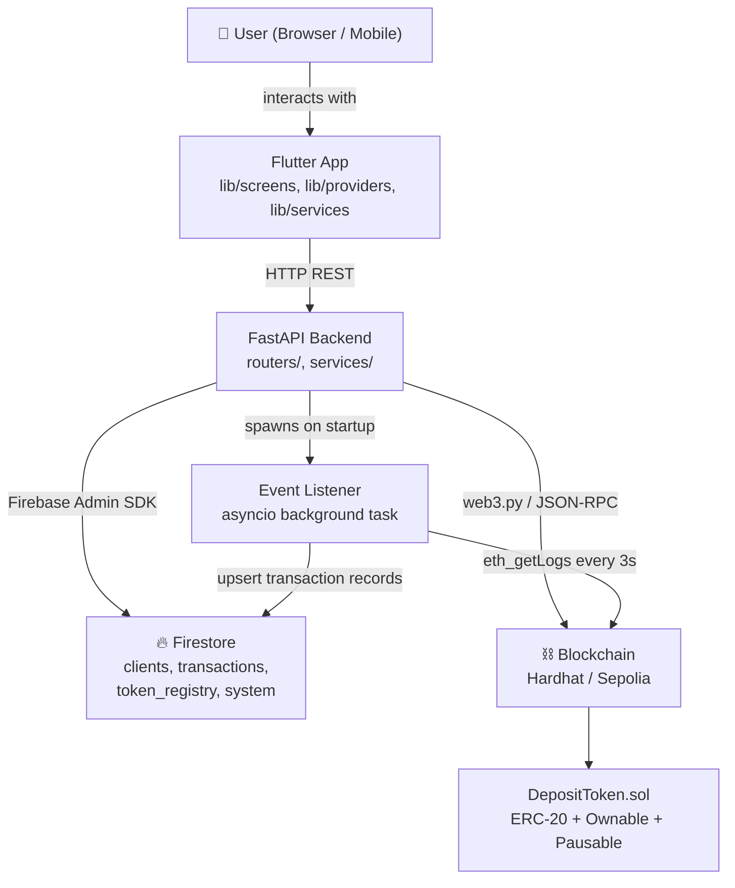

---

## Directory Structure

```
tokenized-deposits/
├── backend/                    # Python FastAPI service
│   ├── main.py                 # App entry point, lifespan, middleware
│   ├── routers/
│   │   ├── clients.py          # All client-facing endpoints
│   │   └── admin.py            # Operator-only endpoints
│   ├── services/
│   │   ├── kyc.py              # KYC verification stub
│   │   ├── wallet.py           # Ethereum address generation
│   │   └── event_listener.py   # Background on-chain event poller
│   └── tests/                  # pytest test suites
│
├── blockchain/                 # Hardhat project
│   ├── contracts/
│   │   └── DepositToken.sol    # The ERC-20 token contract
│   ├── scripts/
│   │   └── deploy.ts           # Deploy script (writes to Firestore)
│   └── test/
│       └── DepositToken.test.ts
│
├── frontend/                   # Flutter app
│   ├── lib/
│   │   ├── main.dart           # App entry, global providers, session restore
│   │   ├── config/app_config.dart
│   │   ├── models/             # Plain Dart data classes
│   │   ├── providers/          # Riverpod state notifiers
│   │   ├── screens/            # UI screens
│   │   └── services/           # ApiClient, SessionService
│   └── test/                   # Flutter widget tests
│
├── firestore.rules             # Deny all client-side access (backend-only via Admin SDK)
└── firestore.indexes.json      # Composite index definitions
```

---

## The Smart Contract — `DepositToken.sol`

**File:** `blockchain/contracts/DepositToken.sol`

Each `(asset_type, network)` pair gets its own deployed instance of this contract. E.g. USD on hardhat is one contract, EUR on Sepolia is another.

```solidity
contract DepositToken is ERC20, Ownable, Pausable {
    string public assetType;      // e.g. "USD"
    string public networkLabel;   // e.g. "hardhat"
    mapping(address => bool) private _approved;  // KYC allowlist
```

### Contract Inheritance

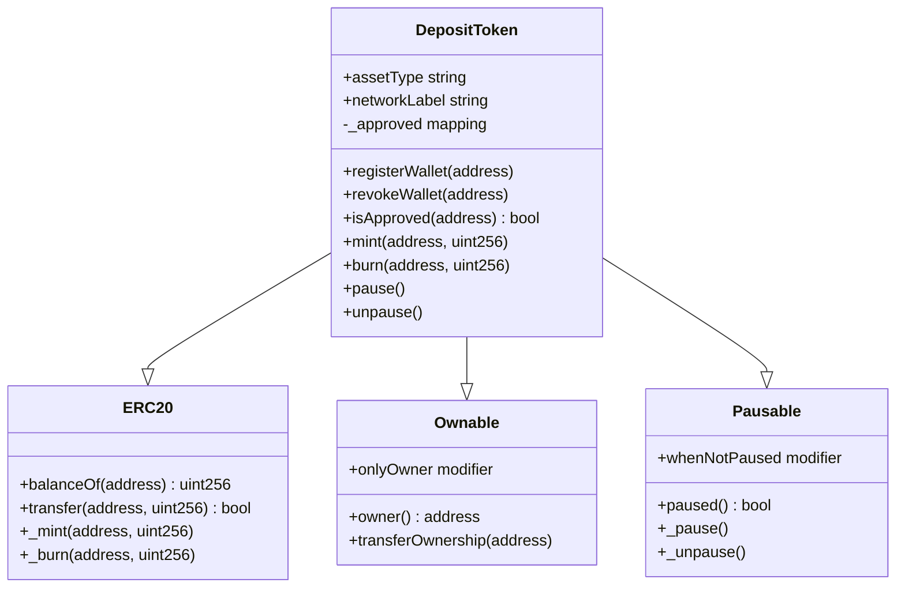

**Key design decisions:**

| Feature | How it works |
|---|---|
| Access control | `onlyOwner` — only the operator wallet (backend) can mint/burn |
| KYC allowlist | `registerWallet(address)` adds a wallet; mint/burn revert with `WalletNotApproved` if not in the list |
| Pause circuit breaker | `pause()` / `unpause()` block all mint/burn operations; useful for incident response |
| Events | `Mint(address indexed recipient, uint256 amount)` and `Burn(address indexed source, uint256 amount)` are emitted and used by the event listener |

**Deployment:** `blockchain/scripts/deploy.ts` deploys a contract, saves the address to a local JSON file, and writes a record to the Firestore `token_registry` collection so the backend can discover it at startup.

---

## Firestore Collections

All Firestore access is via the Firebase Admin SDK (backend only). Client-side access is denied in `firestore.rules`.

### Collection Schema

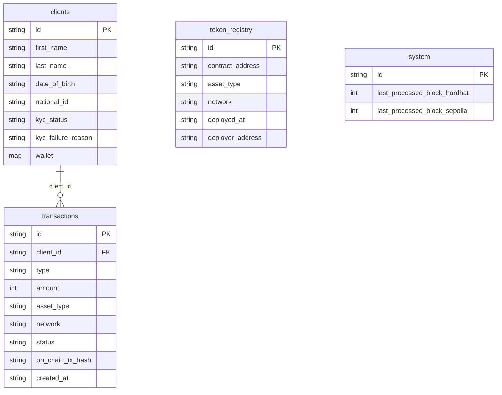

### `clients/{client_id}`
```json
{
  "id": "uuid",
  "first_name": "Alice",
  "last_name": "Smith",
  "date_of_birth": "1990-01-15",
  "national_id": "AB1234",
  "kyc_status": "approved",
  "kyc_failure_reason": null,
  "wallet": {
    "hardhat": "0xABC...",
    "sepolia": "0xDEF..."
  }
}
```

### `transactions/{tx_id}`
```json
{
  "id": "uuid-or-tx-hash",
  "client_id": "uuid",
  "type": "deposit",
  "amount": 100,
  "asset_type": "USD",
  "network": "hardhat",
  "status": "confirmed",
  "on_chain_tx_hash": "0x...",
  "created_at": "2026-04-05T10:00:00Z"
}
```

### `token_registry/{asset_type}_{network}`
```json
{
  "contract_address": "0x...",
  "asset_type": "USD",
  "network": "hardhat",
  "deployed_at": "2026-04-05T09:00:00Z",
  "deployer_address": "0x..."
}
```

### `system/event_listener`
```json
{
  "last_processed_block_hardhat": 42,
  "last_processed_block_sepolia": 17000000
}
```
Used as a cursor so the event listener knows which blocks have already been processed.

---

## Backend Startup Sequence

**File:** `backend/main.py`

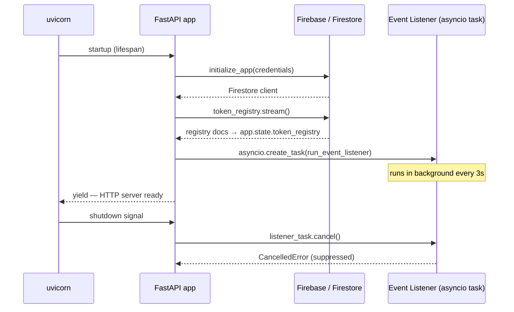

The `token_registry` dict is kept in `app.state` and shared across all requests. The event listener refreshes it on every poll cycle so newly deployed contracts are picked up without a restart.

---

## User Flows

### 1. App Launch & Session Restore

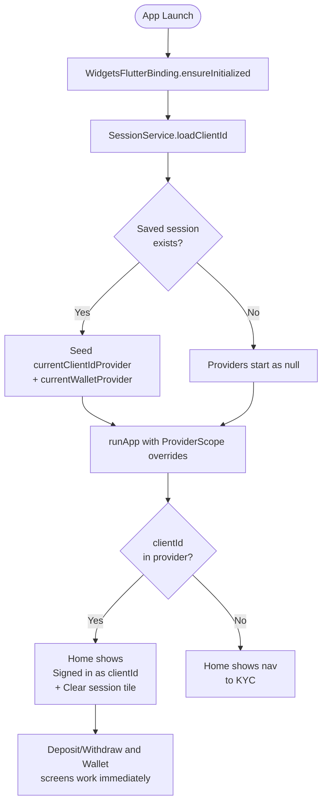

---

### 2. KYC + Wallet Creation

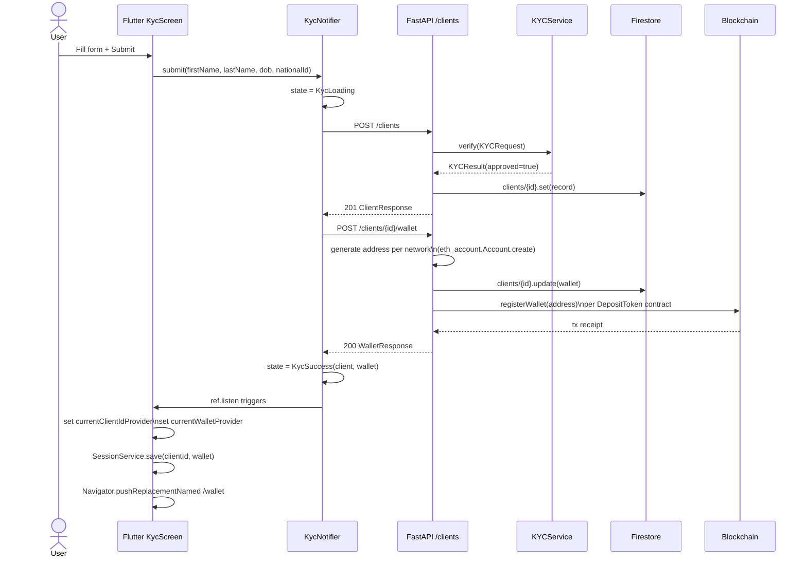

**KYC failure path:**
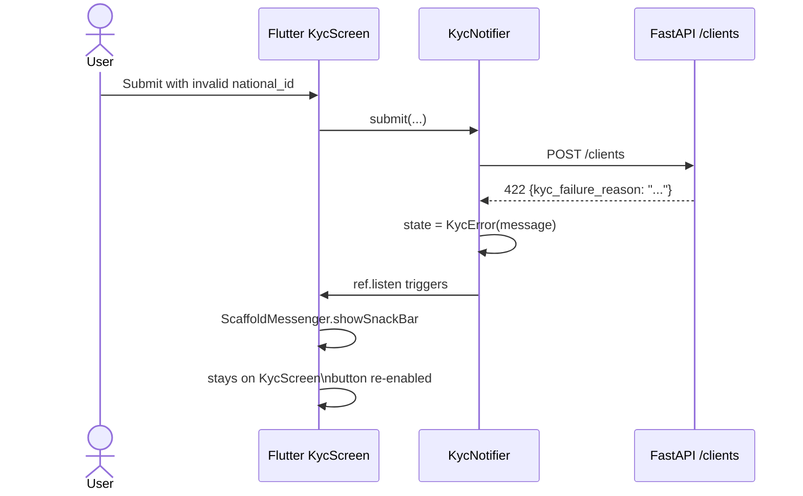

---

### 3. Deposit (Fiat → Tokens)

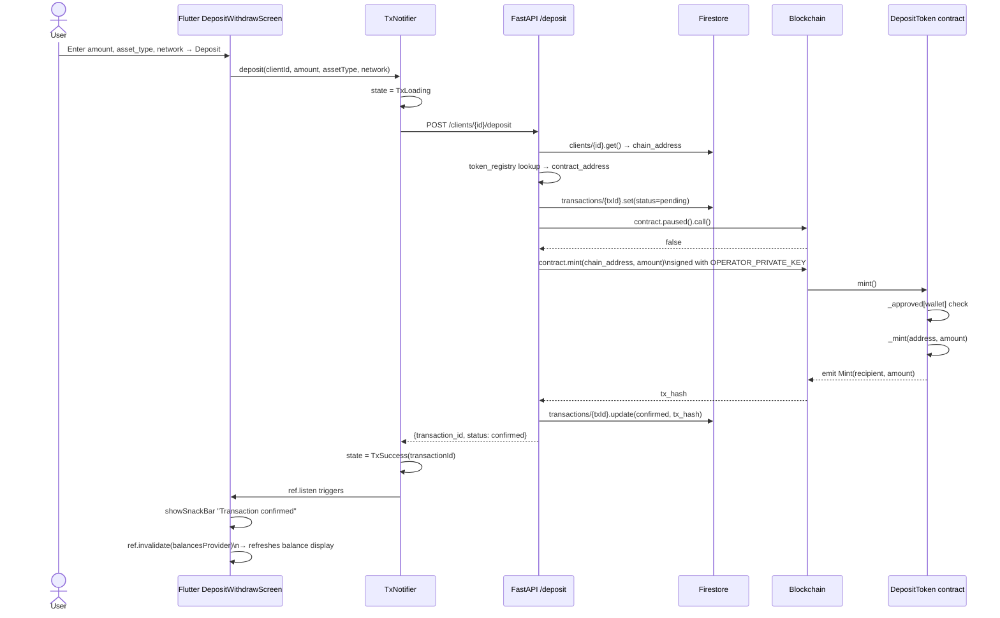

---

### 4. Withdrawal (Tokens → Fiat)

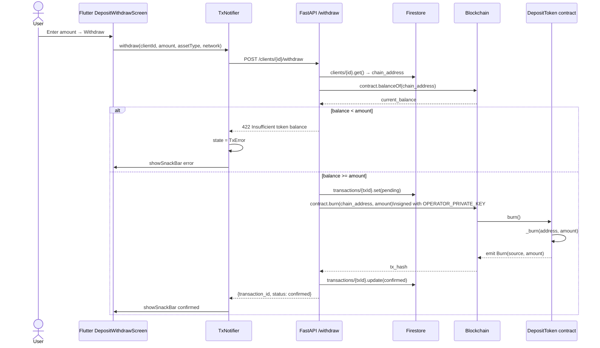

---

### 5. Event Listener (Background Sync)

**File:** `backend/services/event_listener.py`

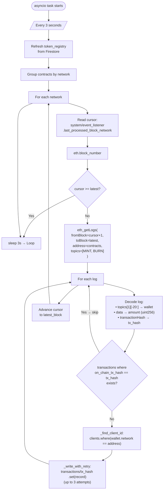

**Topic computation:**
```python
MINT_TOPIC = Web3.keccak(text="Mint(address,uint256)").hex()
BURN_TOPIC  = Web3.keccak(text="Burn(address,uint256)").hex()
```
These match the `event Mint(address indexed recipient, uint256 amount)` signature in the Solidity contract.

---

### 6. Admin — Reconciliation

**Endpoint:** `GET /admin/reconcile` (requires `X-API-Key` header)

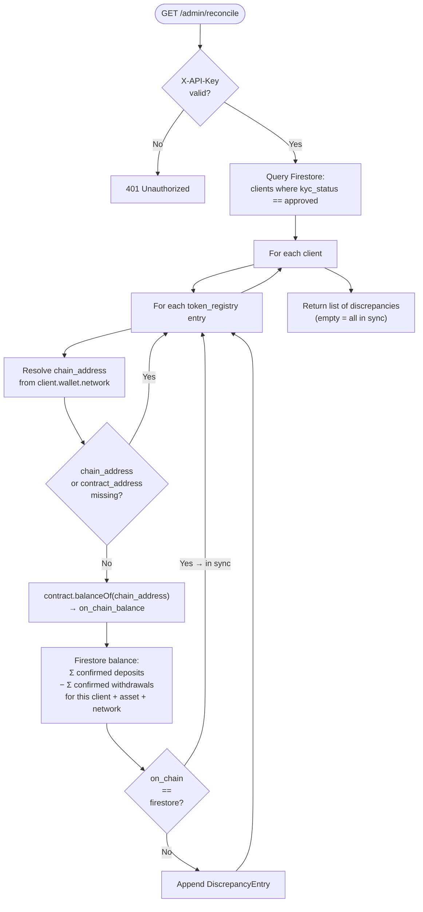

---

## Frontend State Management

**Library:** Riverpod 2.x (`flutter_riverpod`)

### Provider Dependency Graph

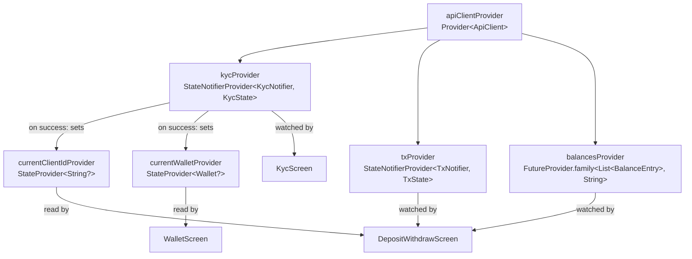

### Sealed State Classes

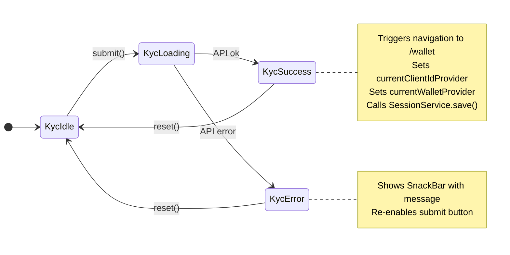

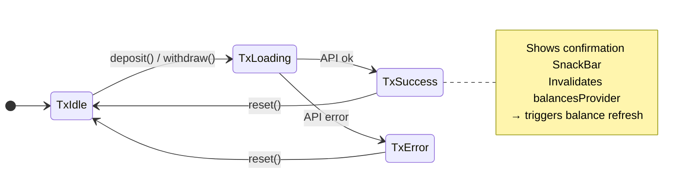

### Session persistence (`lib/services/session_service.dart`)

Uses `shared_preferences` to persist the `clientId` and wallet JSON to device/browser storage. On startup, `main()` reads these before `runApp()` and seeds the providers via `ProviderScope` overrides, so the user's session survives page refreshes and app restarts.

```dart
// main() startup sequence
WidgetsFlutterBinding.ensureInitialized();
final savedClientId = await SessionService.loadClientId();
final savedWallet   = await SessionService.loadWallet();
runApp(ProviderScope(
  overrides: [
    currentClientIdProvider.overrideWith((ref) => savedClientId),
    currentWalletProvider.overrideWith((ref) => savedWallet),
  ],
  child: const TokenizedDepositsApp(),
));
```

---

## API Reference

| Method | Path | Auth | Description |
|---|---|---|---|
| POST | `/clients` | — | KYC verification + client creation |
| POST | `/clients/{id}/wallet` | — | Generate chain addresses + on-chain registration |
| POST | `/clients/{id}/deposit` | — | Mint tokens for a fiat deposit |
| POST | `/clients/{id}/withdraw` | — | Burn tokens for a fiat withdrawal |
| GET | `/clients/{id}/balance` | — | On-chain balance for one `(asset_type, network)` |
| GET | `/clients/{id}/balances` | — | On-chain balances for all token registry pairs |
| GET | `/clients/{id}/transactions` | — | Firestore transaction history |
| POST | `/admin/pause` | `X-API-Key` | Pause a DepositToken contract |
| POST | `/admin/unpause` | `X-API-Key` | Unpause a DepositToken contract |
| GET | `/admin/reconcile` | `X-API-Key` | Compare on-chain vs. Firestore balances |
| GET | `/health` | — | Liveness check |

---

## Running Locally

**Prerequisites:** Python 3.11+, Node 18+, Flutter 3.x, Firebase project with Firestore.

```bash
# 1. Start the local blockchain
cd blockchain
npm install
npm run node                          # keeps running in terminal 1

# 2. Deploy a token contract (terminal 2)
npx hardhat run scripts/deploy.ts --network localhost \
  -- --asset-type USD --network-label hardhat

# 3. Start the backend (terminal 3)
cd backend
python -m venv venv && source venv/bin/activate
pip install -r requirements.txt
cp secrets/firebase-credentials.json ...   # populate from Firebase Console
uvicorn main:app --reload

# 4. Start the Flutter app (terminal 4)
cd frontend
flutter run -d chrome \
  --dart-define=BASE_API_URL=http://localhost:8000
```

**Environment variables (backend `.env`):**

| Variable | Purpose |
|---|---|
| `OPERATOR_PRIVATE_KEY` | Hardhat/Sepolia account that owns the contracts |
| `HARDHAT_RPC_URL` | Defaults to `http://127.0.0.1:8545` |
| `SEPOLIA_RPC_URL` | Alchemy/Infura URL for Sepolia testnet |
| `ADMIN_API_KEY` | Secret for `/admin/*` endpoints |
| `GOOGLE_APPLICATION_CREDENTIALS` | Path to Firebase service account JSON |

---

## Key Design Patterns

**Dual-write consistency:** Every deposit/withdrawal creates a Firestore record *and* submits an on-chain transaction. The event listener provides a safety net by independently reading on-chain events and creating Firestore records if they are missing, keeping the two stores in sync.

**Operator key model:** The backend operator wallet is the sole `owner` of all DepositToken contracts. Clients never hold private keys that can mint or burn — they only hold addresses where tokens are credited. This means the backend controls all token operations.

**Idempotency:** The event listener keys transaction records on `on_chain_tx_hash`, so replaying events (e.g. after a restart) never creates duplicates.

**Test overrides:** `apiClientProvider` is a plain `Provider` that tests replace via `ProviderScope(overrides: [...])`. Backend tests patch `main.run_event_listener` with `AsyncMock` to prevent the background task from running during test setup.
